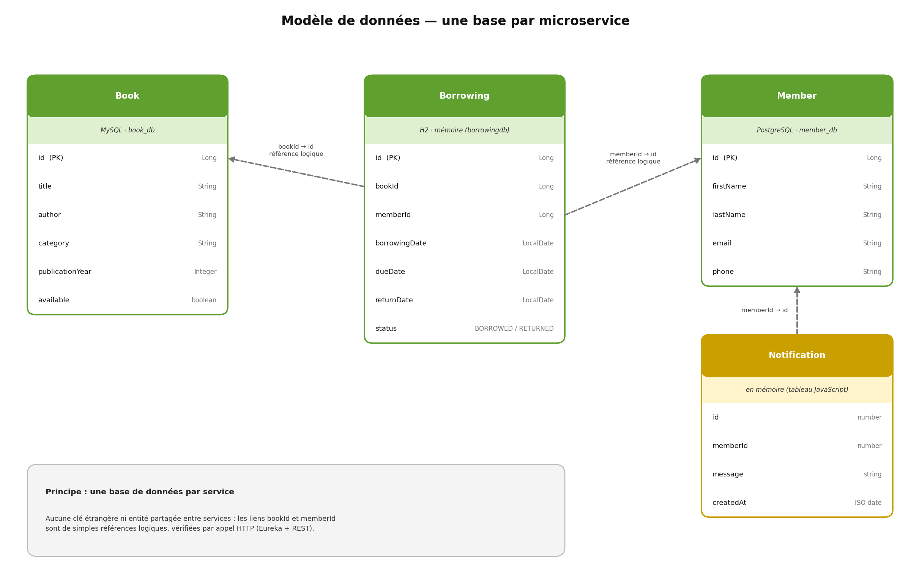
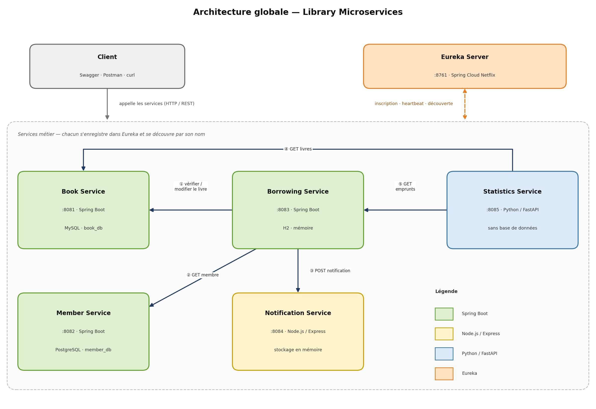
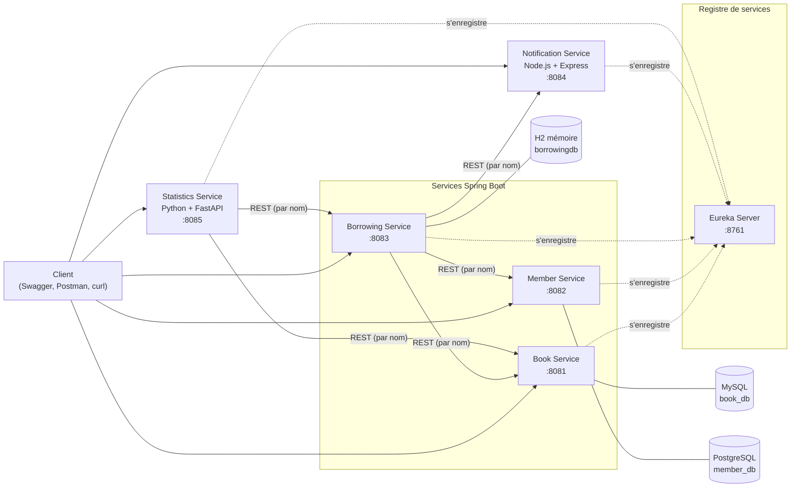
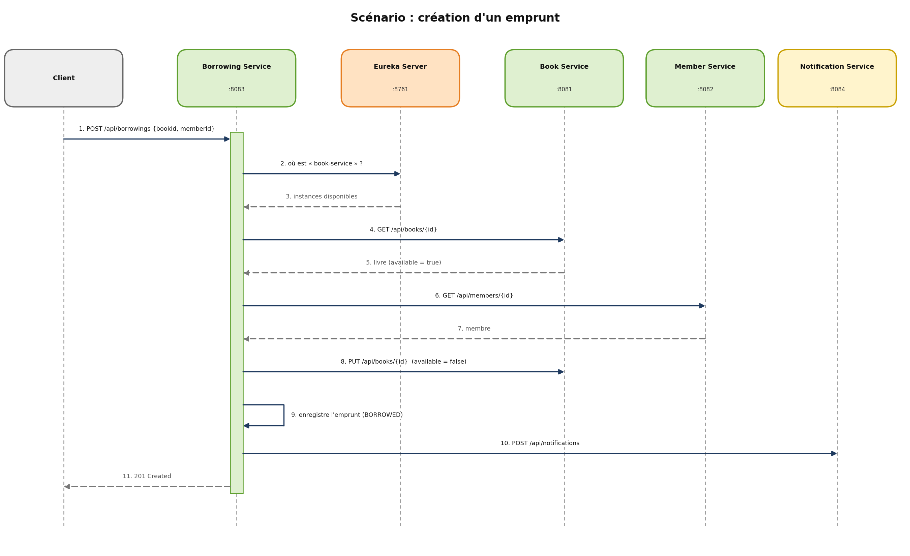
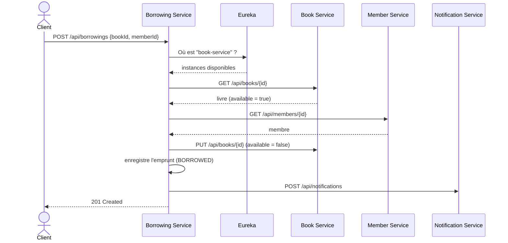
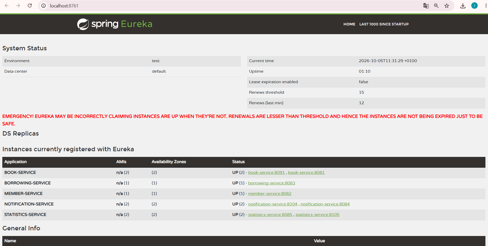
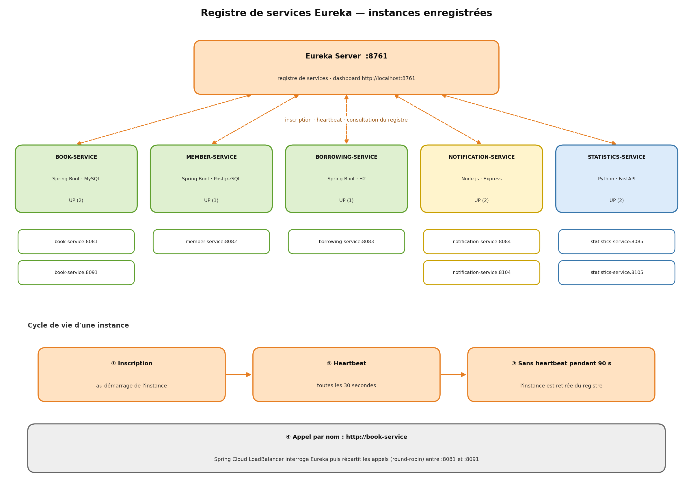

# 📚 Library Microservices — Gestion d'une bibliothèque

Application de **gestion de bibliothèque** construite en **architecture microservices** : 5 microservices métier écrits dans 3 langages (Java, JavaScript, Python), un serveur de découverte **Eureka**, trois bases de données différentes, et une communication entre services par **HTTP REST**.

Ce projet est aussi le support de l'**atelier « Implémentation Eureka Server »** (cours *Applications Web Distribuées*, UP_WEB, ESPRIT).

> **Équipe** : Oueslati Mohamed, Zarrouk Nadim , Sahli Omaima , Hajji Aya , Manai Samar

---

## Sommaire

1. [Description du projet](#1-description-du-projet)
2. [Conception](#2-conception)
3. [Architecture globale](#3-architecture-globale)
4. [Détails de l'atelier Eureka](#4-détails-de-latelier-eureka)
5. [Prérequis](#5-prérequis)
6. [Configuration des bases de données](#6-configuration-des-bases-de-données)
7. [Lancer le projet](#7-lancer-le-projet)
8. [Tester l'application](#8-tester-lapplication)
9. [Structure des dossiers](#9-structure-des-dossiers)
10. [Dépannage](#10-dépannage)
11. [Limites et améliorations possibles](#11-limites-et-améliorations-possibles)

---

## 1. Description du projet

L'application permet de :

- gérer les **livres** de la bibliothèque (catalogue, disponibilité) ;
- gérer les **membres** ;
- gérer les **emprunts** et les **retours** de livres ;
- envoyer des **notifications** aux membres lors d'un emprunt ou d'un retour ;
- consulter des **statistiques** simples (nombre de livres, livres disponibles, emprunts, emprunts en cours).

### Objectifs pédagogiques

- Découper une application en microservices **indépendants**.
- Faire communiquer des services écrits dans **des langages différents** via REST.
- Mettre en place un **registre de services** (Eureka) pour que les services se retrouvent par leur **nom** plutôt que par une adresse écrite en dur.
- Lancer **plusieurs instances** d'un même service et observer la **répartition de charge**.
- Appliquer le principe « **une base de données par service** » avec des technologies différentes.

---

## 2. Conception

### 2.1 Cas d'utilisation

| Acteur | Cas d'utilisation |
|--------|-------------------|
| Bibliothécaire | Ajouter, modifier, supprimer, consulter un livre |
| Bibliothécaire | Ajouter, modifier, supprimer, consulter un membre |
| Bibliothécaire | Enregistrer un emprunt, enregistrer un retour |
| Bibliothécaire | Consulter les notifications et les statistiques |
| Système | Notifier le membre après un emprunt ou un retour |

### 2.2 Modèle de données

Chaque service possède **son propre modèle** ; il n'y a aucune clé étrangère ni entité partagée entre services (le Borrowing Service stocke simplement `bookId` et `memberId`).



| Service | Entité | Champs |
|---------|--------|--------|
| Book | `Book` | `id`, `title`, `author`, `category`, `publicationYear`, `available` |
| Member | `Member` | `id`, `firstName`, `lastName`, `email`, `phone` |
| Borrowing | `Borrowing` | `id`, `bookId`, `memberId`, `borrowingDate`, `dueDate`, `returnDate`, `status` (`BORROWED` / `RETURNED`) |
| Notification | `Notification` | `id`, `memberId`, `message`, `createdAt` |

### 2.3 API REST

| Service | Endpoints |
|---------|-----------|
| **Book** (8081) | `GET /api/books`, `GET /api/books/{id}`, `POST /api/books`, `PUT /api/books/{id}`, `DELETE /api/books/{id}` |
| **Member** (8082) | `GET /api/members`, `GET /api/members/{id}`, `POST /api/members`, `PUT /api/members/{id}`, `DELETE /api/members/{id}` |
| **Borrowing** (8083) | `GET /api/borrowings`, `GET /api/borrowings/{id}`, `POST /api/borrowings`, `PUT /api/borrowings/{id}`, `DELETE /api/borrowings/{id}`, `PUT /api/borrowings/{id}/return` |
| **Notification** (8084) | `GET /api/notifications/hello`, `POST /api/notifications`, `GET /api/notifications` (filtre `?memberId=`), `GET /health` |
| **Statistics** (8085) | `GET /api/statistics`, `GET /api/statistics/books`, `GET /api/statistics/borrowings`, `GET /health` |

### 2.4 Choix de conception

- **Une base de données par service** : aucun partage d'entités JPA ni de repositories.
- **Découverte par nom** : les services s'appellent via Eureka (`http://book-service`), jamais via `localhost:8081`.
- **Gestion des erreurs HTTP** dans le Borrowing Service :

  | Situation | Code |
    |-----------|------|
  | Livre, membre ou emprunt introuvable | `404` |
  | Livre déjà emprunté / emprunt déjà retourné | `409` |
  | Données invalides | `400` |
  | Book ou Member Service injoignable | `503` |
  | Notification Service injoignable | ignoré (avertissement dans les logs) |

- **Notification non bloquante** : un emprunt reste valide même si Notification Service est arrêté.
- **Compensation simple** : si l'enregistrement de l'emprunt échoue après la réservation du livre, le livre est remis disponible.

---

## 3. Architecture globale

### 3.1 Vue d'ensemble





### 3.2 Les microservices

| Microservice | Technologie | Port | Nom dans Eureka | Base de données |
|--------------|-------------|------|-----------------|-----------------|
| Eureka Server | Spring Boot + Spring Cloud Netflix | 8761 | — | — |
| Book Service | Spring Boot, Spring Data JPA | 8081 | `BOOK-SERVICE` | **MySQL** (`book_db`) |
| Member Service | Spring Boot, Spring Data JPA | 8082 | `MEMBER-SERVICE` | **PostgreSQL** (`member_db`) |
| Borrowing Service | Spring Boot, Spring Data JPA, `RestClient` | 8083 | `BORROWING-SERVICE` | **H2** en mémoire |
| Notification Service | Node.js, Express, `eureka-js-client` | 8084 | `NOTIFICATION-SERVICE` | Aucune (en mémoire) |
| Statistics Service | Python, FastAPI, Uvicorn, `py-eureka-client` | 8085 | `STATISTICS-SERVICE` | Aucune |

Versions : **Java 17+**, **Spring Boot 3.3.5**, **Spring Cloud 2023.0.3**, springdoc-openapi 2.6.0.

### 3.3 Communications entre services

| # | Appelant | Appelé | Objet |
|---|----------|--------|-------|
| 1 | Borrowing | Book | Vérifier le livre (`GET`) et changer sa disponibilité (`PUT`) |
| 2 | Borrowing | Member | Vérifier l'existence du membre (`GET`) |
| 3 | Borrowing | Notification | Envoyer une notification (`POST`) |
| 4 | Statistics | Book | Récupérer les livres (`GET`) |
| 5 | Statistics | Borrowing | Récupérer les emprunts (`GET`) |
| 6 | Tous | Eureka | Inscription, heartbeat, consultation du registre |

### 3.4 Scénario : création d'un emprunt





---

## 4. Détails de l'atelier Eureka

### 4.1 Contexte

Quand une application doit absorber une montée en charge, on lance **plusieurs instances** de chaque microservice. Il faut alors un **registre** qui connaît toutes les instances (adresse IP, port) pour répartir la charge. **Eureka** (Netflix) joue ce rôle. Comme il expose une **API REST**, des services Java, JavaScript et Python peuvent tous s'y enregistrer.

Chaque instance envoie un **heartbeat toutes les 30 secondes** ; sans nouvelle pendant 90 secondes, elle est retirée du registre.



### 4.2 Objectifs

- [x] Créer un **serveur de découverte Eureka**
- [x] Enregistrer les services Spring Boot comme **clients Eureka**
- [x] Lancer **plusieurs instances** d'un service et les observer dans Eureka
- [x] Enregistrer des services **Node.js** et **Python** dans Eureka

### 4.3 Partie 1 — Eureka Server (port 8761)

Dépendance : `spring-cloud-starter-netflix-eureka-server`, avec le BOM `spring-cloud-dependencies` (`spring-cloud.version` = `2023.0.3`).

```java
@SpringBootApplication
@EnableEurekaServer
public class EurekaServerApplication {
    public static void main(String[] args) {
        SpringApplication.run(EurekaServerApplication.class, args);
    }
}
```

```properties
spring.application.name=eureka
server.port=8761
eureka.client.register-with-eureka=false   # le serveur ne s'enregistre pas lui-même
eureka.client.fetch-registry=false         # ni ne met en cache le registre
```

Tableau de bord : <http://localhost:8761>

### 4.4 Partie 2 — Clients Eureka Spring Boot

Dépendance ajoutée à Book, Member et Borrowing : `spring-cloud-starter-netflix-eureka-client` (+ `spring-cloud-starter-loadbalancer` pour Borrowing).

```java
@SpringBootApplication
@EnableDiscoveryClient   // facultatif avec les versions récentes, gardé pour la lisibilité
public class BookServiceApplication {  };
```

```properties
eureka.client.service-url.defaultZone=http://localhost:8761/eureka
eureka.client.register-with-eureka=true
eureka.client.fetch-registry=true
eureka.instance.instance-id=${spring.application.name}:${server.port}
```

> La ligne `instance-id` est **indispensable** pour lancer plusieurs instances : elle donne un identifiant unique (`book-service:8081`, `book-service:8091`…). Sans elle, les instances se remplaceraient dans le registre.

**Appels par nom de service** (Borrowing Service) : un `RestClient` avec répartition de charge.

```java
@Configuration
public class RestClientConfig {
    @Bean
    @LoadBalanced
    @Scope("prototype")   // un builder distinct par client
    RestClient.Builder loadBalancedRestClientBuilder() {
        return RestClient.builder();
    }
}
```
```properties
services.book.url=http://book-service
services.member.url=http://member-service
services.notification.url=http://notification-service
```

Spring Cloud LoadBalancer interroge Eureka, choisit une instance (**round-robin**) et appelle l'URL réelle. Si aucune instance n'est disponible, une `IllegalStateException` est convertie en réponse `503`.

### 4.5 Partie 3 — Clients Eureka Node.js et Python

**Notification Service (Node.js)** — bibliothèque `eureka-js-client` :

```js
const eurekaClient = new Eureka({
  instance: {
    app: 'NOTIFICATION-SERVICE',
    instanceId: `notification-service:${PORT}`,
    hostName: 'localhost',
    ipAddr: '127.0.0.1',
    port: { '$': Number(PORT), '@enabled': true },
    vipAddress: 'notification-service',
    statusPageUrl: `http://localhost:${PORT}/health`,
    healthCheckUrl: `http://localhost:${PORT}/health`,
    dataCenterInfo: {
      '@class': 'com.netflix.appinfo.InstanceInfo$DefaultDataCenterInfo',
      name: 'MyOwn',
    },
  },
  eureka: { host: 'localhost', port: 8761, servicePath: '/eureka/apps/', fetchRegistry: false },
});
eurekaClient.start();
process.on('SIGINT', () => eurekaClient.stop(() => process.exit()));  // désinscription propre
```
Le port est lu depuis la variable d'environnement `PORT` (`process.env.PORT || 8084`).

**Statistics Service (Python / FastAPI)** — bibliothèque `py-eureka-client`, inscription dans le `lifespan` de FastAPI :

```python
@asynccontextmanager
async def lifespan(app: FastAPI):
    await eureka_client.init_async(
        eureka_server="http://localhost:8761/eureka",
        app_name="STATISTICS-SERVICE",
        instance_id=f"statistics-service:{PORT}",
        instance_host="localhost",
        instance_port=PORT,
        health_check_url=f"http://localhost:{PORT}/health",
        status_page_url=f"http://localhost:{PORT}/health",
    )
    yield
    await eureka_client.stop_async()
```
Les appels vers les autres services se font **par nom** : `eureka_client.do_service_async("BOOK-SERVICE", "/api/books", return_type="json")`.

### 4.6 Plusieurs instances

| Service | Instance 1 | Instance 2 | Instance 3 |
|---------|-----------|-----------|-----------|
| Book (Spring Boot) | 8081 | 8091 | 8101 |
| Notification (Node.js) | 8084 | 8094 | 8104 |
| Statistics (Python) | 8085 | 8095 | 8105 |

- **Spring Boot** — IntelliJ : *Run → Edit Configurations → Copy Configuration → Modify options → Add VM options* : `-Dserver.port=8091`. Ou en ligne de commande :
  ```bash
  mvn spring-boot:run "-Dspring-boot.run.arguments=--server.port=8091"
  ```
- **Node.js** (un terminal par instance) :
  ```powershell
  $env:PORT=8094; npm start
  ```
- **Python** (un terminal par instance) :
  ```powershell
  $env:PORT=8095; python main.py
  ```

### 4.7 Résultat obtenu

Tableau de bord Eureka avec les 5 services enregistrés et plusieurs instances de Book, Notification et Statistics :



| Application | Instances | Détail |
|-------------|-----------|--------|
| `BOOK-SERVICE` | 2 | `book-service:8081`, `book-service:8091` |
| `BORROWING-SERVICE` | 1 | `borrowing-service:8083` |
| `MEMBER-SERVICE` | 1 | `member-service:8082` |
| `NOTIFICATION-SERVICE` | 2 | `notification-service:8084`, `notification-service:8104` |
| `STATISTICS-SERVICE` | 2 | `statistics-service:8085`, `statistics-service:8105` |

> 💡 **À propos du message rouge « EMERGENCY! EUREKA MAY BE INCORRECTLY CLAIMING INSTANCES ARE UP… »** : c'est le **mode d'auto-préservation** d'Eureka. Avec peu d'instances, le nombre de renouvellements reçus peut passer sous le seuil attendu ; Eureka cesse alors d'expirer les instances pour éviter de vider le registre en cas de problème réseau. C'est **normal en développement** et sans gravité. Conséquence : une instance arrêtée brutalement peut rester affichée `UP` un moment. Pour désactiver ce comportement en local, ajouter dans le `application.properties` d'Eureka : `eureka.server.enable-self-preservation=false`.

### 4.8 Vérifications demandées par l'atelier

| Vérification | Statut |
|--------------|--------|
| Chaque service est enregistré automatiquement dans Eureka | ✅ |
| Chaque service est visible dans le dashboard (`http://localhost:8761`) | ✅ |
| Plusieurs instances avec des ports différents | ✅ |
| Les endpoints continuent de répondre (`/api/notifications/hello`) | ✅ |
| Découverte d'un service par son nom, sans URL en dur (Borrowing → Book, Statistics → Book/Borrowing) | ✅ |
| Endpoint `/health` déclaré comme `healthCheckUrl` / `statusPageUrl` (Node.js, Python) | ✅ |

---

## 5. Prérequis

| Outil | Version | Vérification |
|-------|---------|--------------|
| JDK | 17 ou plus | `java -version` |
| Maven | 3.9+ (ou celui d'IntelliJ) | `mvn -v` |
| Node.js + npm | 18+ | `node -v` |
| Python | 3.10+ | `python --version` |
| MySQL | via XAMPP (port 3306) | panneau XAMPP |
| PostgreSQL | 17 ou 18 (port 5432) | `services.msc` |

---

## 6. Configuration des bases de données

| Service | Base | Configuration |
|---------|------|---------------|
| Book | MySQL `book_db` | créée automatiquement (`createDatabaseIfNotExist=true`) |
| Member | PostgreSQL `member_db` | **à créer manuellement** (pgAdmin → clic droit sur *Databases* → *Create*) |
| Borrowing | H2 en mémoire | aucune installation |

**Book Service** (`application.properties`) :
```properties
spring.datasource.url=jdbc:mysql://localhost:3306/book_db?createDatabaseIfNotExist=true&useSSL=false&serverTimezone=UTC&allowPublicKeyRetrieval=true
spring.datasource.username=root
spring.datasource.password=
spring.datasource.driver-class-name=com.mysql.cj.jdbc.Driver
spring.jpa.hibernate.ddl-auto=update
```

**Member Service** :
```properties
spring.datasource.url=jdbc:postgresql://localhost:5432/member_db
spring.datasource.username=postgres
spring.datasource.password=VOTRE_MOT_DE_PASSE
spring.datasource.driver-class-name=org.postgresql.Driver
spring.jpa.hibernate.ddl-auto=update
```

**Borrowing Service** :
```properties
spring.datasource.url=jdbc:h2:mem:borrowingdb;DB_CLOSE_DELAY=-1
spring.h2.console.enabled=true
```

Des **données de démonstration** (3 livres, 2 membres) sont créées au démarrage si les tables sont vides.

> Avec plusieurs instances d'un service, MySQL et PostgreSQL sont **partagés** par toutes les instances. Avec H2 en mémoire, chaque instance aurait sa propre base : on ne lance donc pas plusieurs instances de Borrowing.

---

## 7. Lancer le projet

### Ordre de démarrage

1. **MySQL** (XAMPP) et **PostgreSQL** (service Windows)
2. **Eureka Server** (8761)
3. **Book** (8081) et **Member** (8082)
4. **Notification** (8084)
5. **Borrowing** (8083)
6. **Statistics** (8085)

Un service peut mettre jusqu'à **30 secondes** à apparaître dans le dashboard.

### Commandes

```bash
# Eureka Server
cd eureka-server && mvn spring-boot:run

# Book / Member / Borrowing
cd book-service && mvn spring-boot:run
cd member-service && mvn spring-boot:run
cd borrowing-service && mvn spring-boot:run

# Notification Service (Node.js)
cd notification-service
npm install
npm start

# Statistics Service (Python)
cd statistics-service
python -m venv .venv
.venv\Scripts\activate          # Windows (Linux/macOS : source .venv/bin/activate)
pip install -r requirements.txt
python main.py
```

### URLs utiles

| Ressource | URL |
|-----------|-----|
| Dashboard Eureka | http://localhost:8761 |
| Swagger Book | http://localhost:8081/swagger-ui/index.html |
| Swagger Member | http://localhost:8082/swagger-ui/index.html |
| Swagger Borrowing | http://localhost:8083/swagger-ui/index.html |
| Swagger Statistics (FastAPI) | http://localhost:8085/docs |
| Hello Notification | http://localhost:8084/api/notifications/hello |
| Console H2 (Borrowing) | http://localhost:8083/h2-console |

---

## 8. Tester l'application

### Créer un emprunt

```bash
curl -X POST http://localhost:8083/api/borrowings \
  -H "Content-Type: application/json" \
  -d '{"bookId":1,"memberId":1}'
```
PowerShell :
```powershell
Invoke-RestMethod -Method Post -Uri http://localhost:8083/api/borrowings `
  -ContentType "application/json" -Body '{"bookId":1,"memberId":1}'
```
Réponse `201` avec `"status": "BORROWED"`. Le livre devient indisponible : `GET http://localhost:8081/api/books/1` → `"available": false`.

### Retourner le livre

```bash
curl -X PUT http://localhost:8083/api/borrowings/1/return
```
Le livre redevient disponible et l'emprunt passe à `RETURNED`.

### Vérifier les notifications

```bash
curl http://localhost:8084/api/notifications
curl "http://localhost:8084/api/notifications?memberId=1"
```
> Les notifications sont stockées **en mémoire, par instance** : avec plusieurs instances de Notification, consultez chaque port (8084, 8094, 8104) pour tout voir.

### Consulter les statistiques

```bash
curl http://localhost:8085/api/statistics
curl http://localhost:8085/api/statistics/books
curl http://localhost:8085/api/statistics/borrowings
```

### Tester la répartition de charge et la tolérance aux pannes

1. Créez plusieurs emprunts et observez, dans les consoles des instances de Book, que les requêtes se répartissent entre elles.
2. Arrêtez **toutes** les instances de Book Service, attendez environ 90 secondes, puis tentez un emprunt : vous obtenez une erreur **503** claire.

---

## 9. Structure des dossiers

```
library-microservices/
├── eureka/                      Spring Boot - 8761
├── book-service/                Spring Boot + MySQL - 8081
│   └── src/main/java/com/library/book/
│       ├── model/ repository/ service/ controller/ exception/
├── member-service/              Spring Boot + PostgreSQL - 8082
├── borrowing-service/           Spring Boot + H2 - 8083
│   └── src/main/java/com/library/borrowing/
│       ├── client/              BookClient, MemberClient, NotificationClient
│       ├── config/              RestClientConfig (@LoadBalanced)
│       ├── dto/ model/ repository/ service/ controller/ exception/
├── notification-service/        Node.js + Express - 8084
│   ├── server.js
│   ├── routes/notificationRoutes.js
│   └── services/notificationService.js
├── statistics-service/          Python + FastAPI - 8085
│   ├── main.py
│   └── requirements.txt
├── Docs/                        images utilisées dans ce README
│   ├── 01-architecture-globale.png
│   ├── 02-sequence-emprunt.png
│   ├── 03-eureka-registre.png
│   ├── 04-modele-donnees.png
│   └── atelier-eureka.png
├── README.md
└── .gitignore
```

---

## 10. Dépannage

| Symptôme | Cause probable / solution |
|----------|---------------------------|
| Un service n'apparaît pas dans Eureka | Attendre 30 s ; vérifier qu'Eureka est lancé **avant** les autres services |
| `Port XXXX was already in use` | Une instance tourne déjà sur ce port |
| Deux instances se remplacent dans Eureka | `instance-id` (Spring) ou `instanceId` (Node/Python) identique |
| `Communications link failure` (Book) | MySQL n'est pas démarré dans XAMPP |
| `password authentication failed` (Member) | Mauvais mot de passe PostgreSQL dans `application.properties` |
| `database "member_db" does not exist` | Créer la base dans pgAdmin |
| `Could not resolve placeholder 'services.book.url'` | Propriétés `services.*` absentes du `application.properties` de Borrowing |
| `No instances available for book-service` | Book Service arrêté ou pas encore enregistré |
| Erreur Maven sur `spring-cloud-dependencies` | Le BOM ne doit apparaître que dans `<dependencyManagement>` |
| Mauvais `application.properties` dans un service | Vérifier `spring.application.name` et `server.port` de chaque projet |
| `$env:PORT` ignoré | Le définir dans le **même** terminal que celui qui lance le service |
| Les images ne s'affichent pas sur GitHub | Vérifier la casse exacte du dossier `Docs/` et des noms de fichiers (GitHub est sensible à la casse) |

---

## 11. Limites et améliorations possibles

- Notifications **en mémoire** : perdues à l'arrêt, non partagées entre instances → ajouter une base (MongoDB, Redis…).
- Pas d'**authentification** (JWT, Keycloak).
- Pas d'**API Gateway** (Spring Cloud Gateway) comme point d'entrée unique.
- Pas de **résilience avancée** (Resilience4j : circuit breaker, retry).
- Communication **synchrone** uniquement → un bus de messages (Kafka, RabbitMQ) pourrait découpler les notifications.
- **Conteneurisation** (Docker Compose) et orchestration (Kubernetes).

---

## Équipe

| Nom | Rôle |
|-----|------|
| _Nom 1_ | _à compléter_ |
| _Nom 2_ | _à compléter_ |
| _Nom 3_ | _à compléter_ |

Projet réalisé dans le cadre du cours **Applications Web Distribuées** — ESPRIT, année universitaire 2026-2027.
